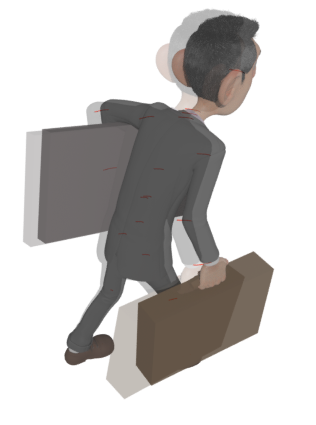
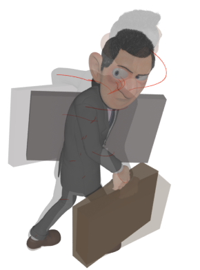
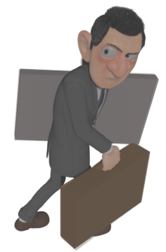
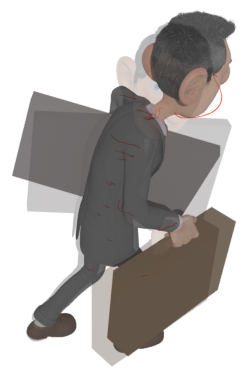
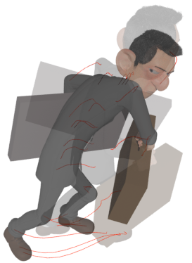
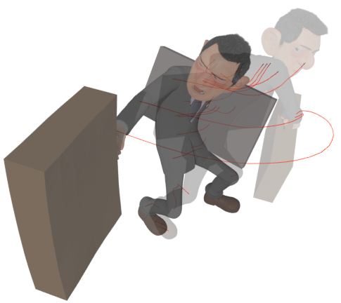
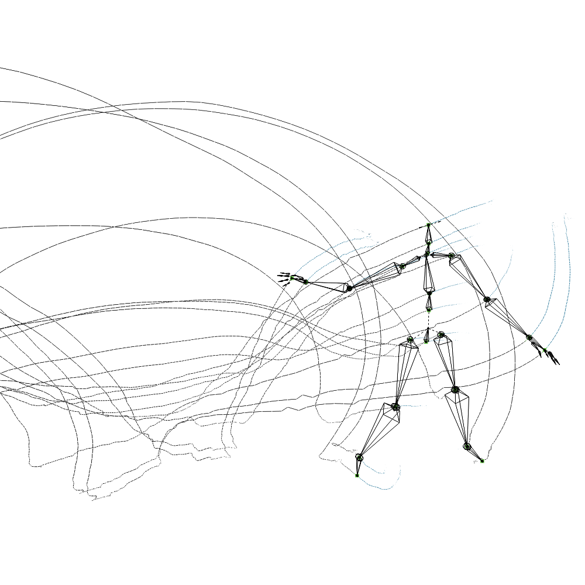
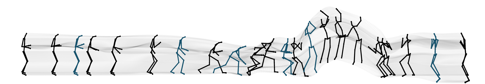

# Converting Motion Capture Into Editable Keyframe Animation

Animations created using motion capture are notoriously difficult to edit, due to a large set of data underlying the animation. As the core component of my doctorate study, I developed a technique to convert motion capture into editable animation:  the technique is designed to perform the conversion so that the new animation is similar in structure to conventional keyframe animation. Since keyframe animation contains significantly fewer data, the new animator can be adjusted more easily.

 

## What is Keyframe Animation?

In computer animation, an animator provides "poses" to create an animation. The poses are set into a timeline and, using curve interpolation, the computer automatically creates fluid animation. We call the set of poses used to create an animation the "keyframes" and, in turn, the resulting animation a "keyframe animation".

Typically, animators tend to use few keyframes to ensure that their animations remain editable: fewer keyframes mean that fewer changes are required to adjust the motion. 

To provide an example of a set of keyframes, the illustration above presents the keyframes used by an animator to create an animation where an Agent character first turns backwards to spot an attacker before swinging their briefcase in defence. The animator's keyframes are placed before and after the backwards-turn and also before and after the swing of the briefcase. Placing the keyframes in this way means that the animator has control over both the shape and the timing of those two movements (the backwards-turn and the swing of the briefcase).

*The animation illustrated above was created as part of the pre-visualization work for the Agent 327 feature film - see more about the short film at the [Blender Institute's website](https://cloud.blender.org/p/agent-327/).*

 

## Hard to Edit? 

Animating a character using motion capture results in an animation that contains a *keyframe at every frame*. Consequently, adjusting a particular keyframe impacts only that frame and no other frames in the animation. In contrast, adjusting the pose of a keyframe, in a keyframe, causes a change to all nearby non-keyframes. Since all frames are keyframes in the case of motion capture, editors need to make a significant number of adjustments in order to edit the animation.

To address the problem of motion capture is difficult to edit, I have designed a three-step technique for converting motion capture animation into editable keyframe animation. In particular; my technique first identifies a set of animator-like keyframes and create a new animation, featuring only those keyframes. When applied successfully, the new animation appears near identical to the original; however, the new animation is easier to edit because it contains significantly fewer keyframes; and furthermore, those remaining keyframes are organized to be best for editing the motion.

 

## Technique

My technique for converting motion capture into keyframe selection features three steps: an *analysis* pre-process that records information about the motion capture animation into a table; a *keyframe selection* step, in which I use information from the table to select a set of animator-like keyframes; and a curve fitting step, in which I fit an interpolation through the keyframes to best recreate the detail of the original motion.

#### Analysis

In the analysis step, I apply an objective function to each section of the motion. The objective function describes the context to which the keyframes are to be selected. The best choice of the objective function depends on the editing task at hand; but, for example, the objective function might describe how easily the given section of the animation can be replaced by a curve interpolating through the keyframes. After analysis, the results of the objective function are stored in a table.

 
<iframe src="https://www.youtube.com/embed/nhHsAloF1kQ?&loop=1&controls=0&showinfo=0&rel=0&playlist=tBGJcjUMeS8&modestbranding=1" frameborder="0" width="500" height="250">
</iframe>

<i>An illustration of the keyframes selected by my technique for an acrobatic animation.</i>

 

#### Keyframe Selection

The second step is designed to identify a set of keyframes, which are best for editing the motion, by running a multi-layer dynamic programming algorithm. The algorithm chooses keyframes to optimize the total of the values provided via the analysis table. Following from the previous example, if the objective function described how easily each section of animation could be replaced with a curve, then the keyframes would be selected to minimize the difficulty in replacing the animation accurately using a curve interpolation. 

Rather than provide only a single selection of keyframes, my technique provides a range of keyframes: one selection for each possible number of keyframes. The following video presents an prototype interface for exploring the range of selections provided by my technique.

 
<iframe src="https://www.youtube.com/embed/r0mQbi8d7aU?&loop=1&controls=0&showinfo=0&rel=0&playlist=tBGJcjUMeS8&modestbranding=1" frameborder="0" width="500" height="250">
</iframe>

<i>A prototype interface, provided as plug-in via Blender. Using the interface, an editor can interactively explore the range of selections provided by Salient Poses.</i>

 

Finally, the third step is designed to construct a new animation by using an optimization-based curve fitting technique to fit an interpolation of the keyframes to the original motion. The results of the fitting can be loaded into standard animation software (such as Autodesk's [Maya](https://www.autodesk.com/products/maya/overview) or Blender Foundation's [Blender](http://blender.org) to produce the new editable animation.

 

<i>A sequence of poses displaying keyframes (black and blue silhouettes) along with the interpolated poses (presented in transparent grey).</i>

 

In summary, my techniques can help editors to obtain editable animation from hard-to-edit motion capture. The resulting animations are more editable because they contain significantly fewer keyframes than the original motion and, consequently, the animation can be edited with significantly fewer adjustments. 

 
<iframe src="https://www.youtube.com/embed/qfF_jh9qSgo?&loop=1&controls=0&showinfo=0&rel=0&playlist=tBGJcjUMeS8&modestbranding=1" frameborder="0" width="500" height="250">
</iframe>

<i>A demonstration of the *motion capture to keyframe animation* pipeline: the left most panel presents the original motion capture through a performance rig, the middle panels present the animation after retargeting to two different characters, and the right two panels present the animation after being edited via keyframes selected by my technique.</i>

 

## More Information

A reference implementation, written in Python, of the three-step technique described above can be obtained through the [repository of this project](http://github.com/richard-roberts/PhD). Performant implementations of the analysis step and Salient Poses are also provided.

More information will soon be available (through better documentation and, hopefully, publication of the work). Please [contact me](richardandrewroberts@gmail.com) at *richardandrewroberts@gmail.com* with any questions.